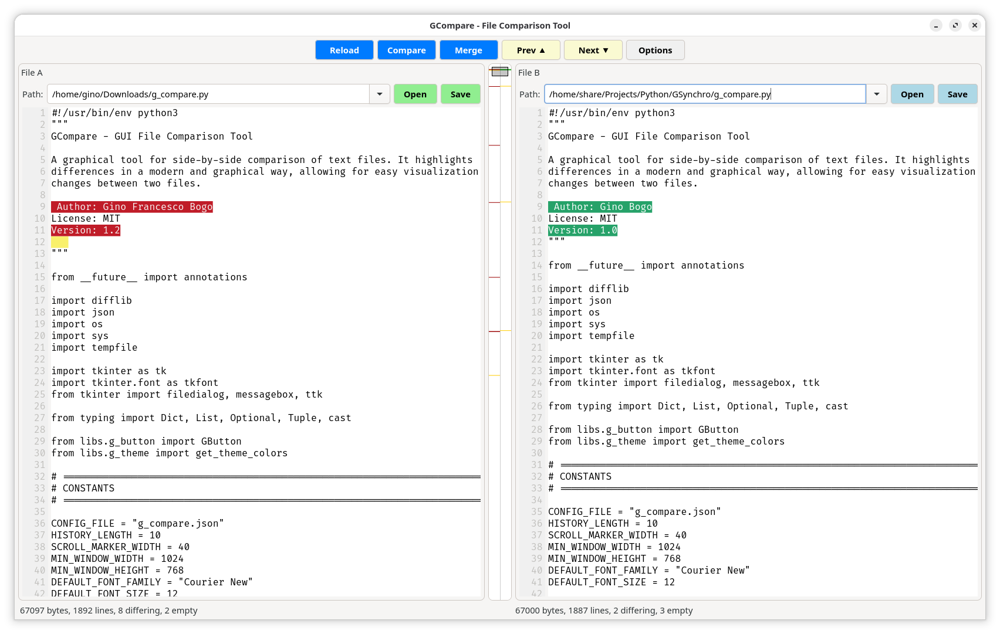
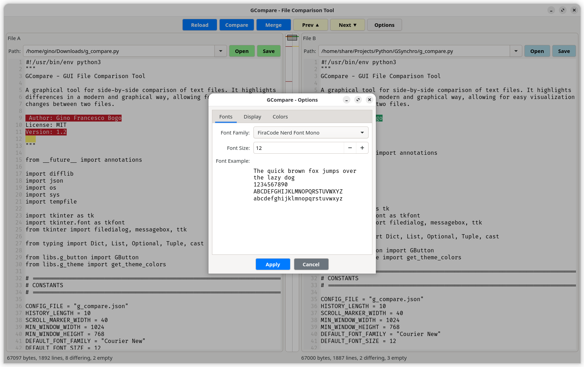
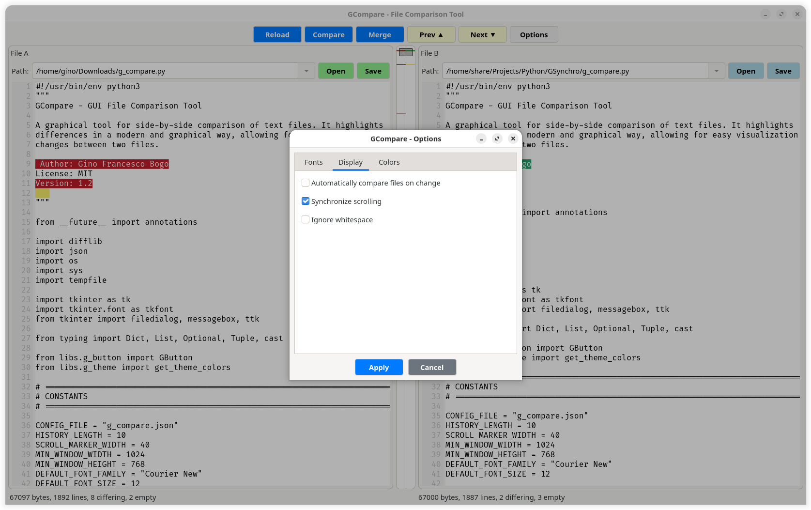
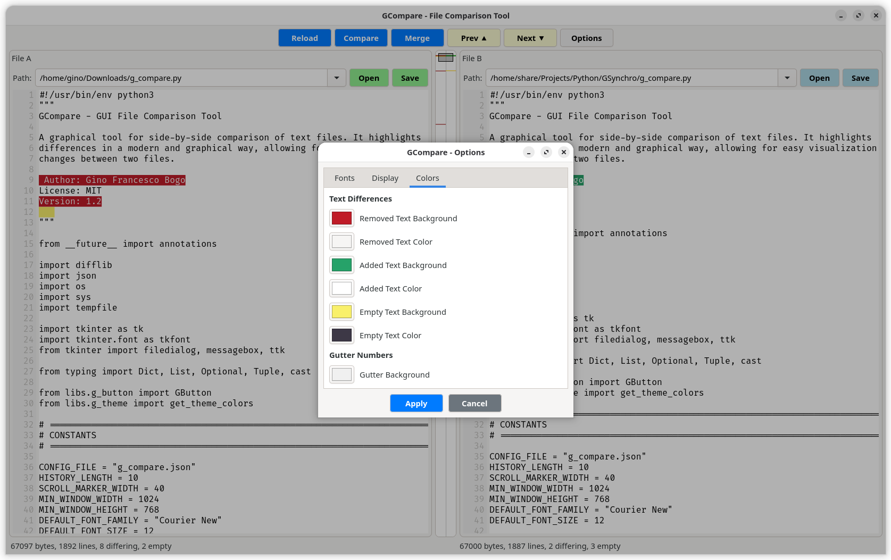
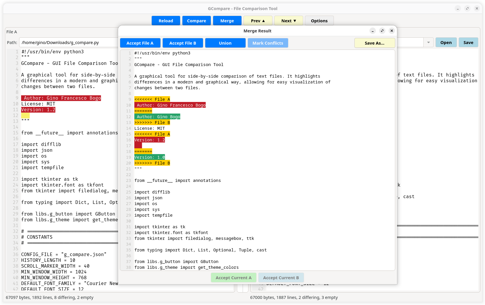

# GCompare

GCompare is a modern, efficient file comparison tool written in Rust using the GTK4 framework. It provides a side-by-side view for comparing files with visual diff highlighting and a navigation map.

## Features

*   **Side-by-Side Comparison**: View two files next to each other to easily spot differences.
*   **Visual Diff Map**: A central "minimap" that highlights additions and deletions, allowing for quick navigation to changed sections via drag-and-drop or clicking.
*   **Synchronized Scrolling**: Scroll both panels simultaneously to keep context aligned.
*   **Diff Highlighting**: Clear visual indicators for added (green) and removed (red) lines.
*   **File History**: Remembers previously opened files for quick access via a combo box.
*   **Merge Files**: Advanced merge capabilities with multiple strategies (Accept Ours, Accept Theirs, Union, Mark Conflicts) and interactive conflict resolution.
*   **Custom UI Components**: Built with specialized GTK4 widgets including `GTextView` with line numbers and `GButton` with theming support.











## Prerequisites

*   Rust (latest stable)
*   GTK4 development libraries

### Installing Dependencies

**Ubuntu/Debian:**
```bash
sudo apt install libgtk-4-dev build-essential
```

**Fedora:**
```bash
sudo dnf install gtk4-devel gcc
```

**Arch Linux:**
```bash
sudo pacman -S gtk4 base-devel
```

## Building and Running

1.  Clone the repository:
    ```bash
    git clone https://github.com/GinoBogo/GCompare.git
    cd GCompare
    ```

2.  Run with Cargo:
    ```bash
    cargo run
    ```

## Project Structure

The project is organized into modular components:

*   `src/libs/widgets`: Custom reusable UI widgets (`GButton`, `GDiffMap`, `GTextView`, `GStatusBar`).
*   `src/libs/ui`: High-level application panels (`ControlPanelWidget`, `ComparisonPanelsWidget`, `MergeViewWidget`).
*   `src/libs/services`: Business logic (`FileService`, `DiffService`, `MergeService`, `ConfigService`).
*   `src/libs/state`: Application state management.

## Third-Party Libraries

This project uses the following Rust crates:

*   font-kit
*   gio
*   gtk4
*   once_cell
*   regex
*   serde
*   serde_json
*   similar

## License

This project is licensed under the MIT License. Third-party libraries used in this project may be subject to their own respective licenses.

## Author

*   Gino Bogo